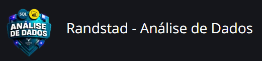

<audio controls>
<source src="output/podcast-editado.mp3" type="audio/mpeg">
</audio>

# Bootcamp Randstad - Análise de Dados da [DIO](https://dio.me)

## Módulo "Seus Primeiros Passos com IA".

### Desafio de Projeto "Análise de Sentimentos com Language Studio no Azure AI".

Este laboratório tem como objetivo praticar e aprofundar o uso das ferramentas Azure Speech Studio e Language Studio, focando na análise de fala e linguagem natural.

## Funcionalidades

- Autenticação com Azure Cognitive Services utilizando chave e endpoint via arquivo `.env`.
- Detecção automática de idioma.
- Análise de sentimentos detalhada (documento, sentenças e opiniões).
- Geração de relatório da análise estruturado em JSON.
- Impressão dos resultados no console.

## Tecnologias Utilizadas

- Python 3.8
- Azure AI Text Analytics SDK
- python-dotenv (Opcional)
- [VSCode](https://code.visualstudio.com/Download)
- JSON

## Contribuição

Sinta-se à vontade para contribuir com este projeto. Envie um `pull request` com suas melhorias e sugestões.

## Licença

Este projeto está licenciado sob a Licença MIT. Veja o arquivo [LICENSE](LICENSE) para mais detalhes.

## 👨‍💻 Autor

    
    
&nbsp&nbsp&nbspMaurício Barros 
    &nbsp&nbsp&nbsp
    <a href="https://github.com/opusvix">
    GitHub</a>&nbsp;|&nbsp;
    <a href="https://www.linkedin.com/in/mauriciodasilvabarros/">LinkedIn</a>
    &nbsp;|&nbsp;
    <a href="https://x.com/opusvix">
    X</a>&nbsp;|&nbsp;
    <a href="mailto:opusvix@gmail.com">E-mail</a>
&nbsp;|&nbsp;

  

---

:hammer_and_wrench: com :sparkling_heart: por [Maurício Barros](https://github.com/opusvix)

